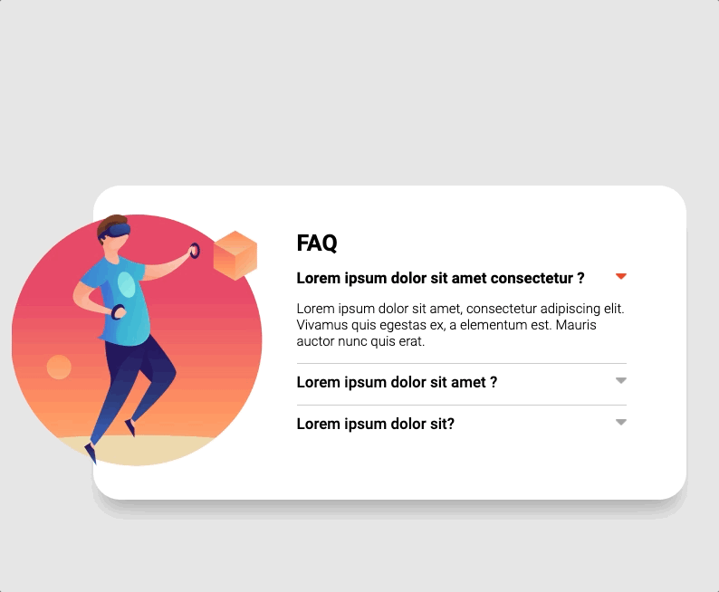

# Acordeon com Javascript

Projeto de acordeon proposto no modulo de Javascript intermediário do curso do Dev Quest. Com o proposito de abrir menus e esconder outra aba quando se clica no titulo da pergunta, utilizando Javascript.

## Tecnologias utilizadas 
- HTML
- CSS
-Javascritp

## Dificuldades no projeto
- Criar o código no Javascript
- Lógica de programação e interação dos elementos HTML no Javascript
